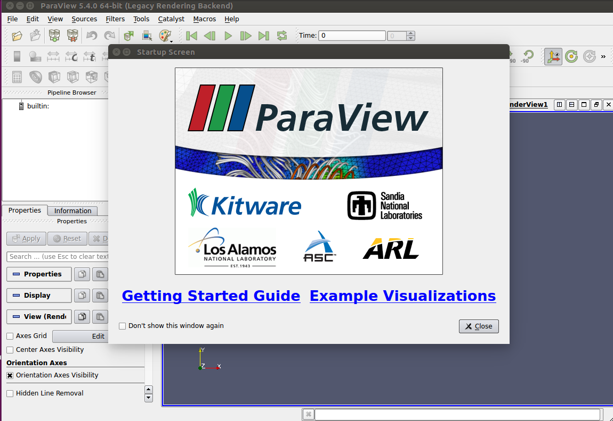

# Paraview on Sherlock

This is an example of using a Singularity container to use Paraview, specifically from [this Docker container](https://hub.docker.com/r/openfoam/openfoam4-paraview50/).

## Image Generation
We can pull the image from Docker Hub, select the version below that is your preference.

```bash
singularity pull --name paraview.simg docker://openfoam/openfoam4-paraview50
singularity pull --name paraview.simg docker://openfoam/openfoam6-paraview54
```

This (50) version of the image is also provided on the Sherlock cluster by @vsoch

```bash
cp /scratch/users/vsoch/share/paraview.simg $SCRATCH
```

Here are the directories created in the image for sherlock, in case you need to bind to share files:

    -/scratch
    -/share/PI
    -/scratch-local


## Using the image

If you need to load singularity as a module or similar, do that first.

```bash 
module load singularity
```

Then shell into the image
```bash
$ singularity shell paraview.simg 
```

The paraview executable is located at `/opt/paraviewopenfoam54/bin/paraview` 


```bash
Singularity: Invoking an interactive shell within container...

Singularity paraview.simg:/home/vanessa/Documents/Dropbox/Code/singularity/docker/singularity> cd /opt/paraviewopenfoam54/
Singularity paraview.simg:/opt/paraviewopenfoam54> ls
bin  include  lib  share
Singularity paraview.simg:/opt/paraviewopenfoam54> ls bin
paraview	 pvrenderserver		vtkLegacyColorMapXMLToJSON  vtkWrapJava-pv5.4	     vtkkwProcessXML-pv5.4
paraview-config  pvserver		vtkParseJava-pv5.4	    vtkWrapPython-pv5.4
pvbatch		 smTestDriver		vtkParseOGLExt-pv5.4	    vtkWrapPythonInit-pv5.4
pvdataserver	 vtkEncodeString-pv5.4	vtkWrapClientServer-pv5.4   vtkWrapTcl-pv5.4
pvpython	 vtkHashSource-pv5.4	vtkWrapHierarchy-pv5.4	    vtkWrapTclInit-pv5.4
```

Then to run paraview, given that you have x11 display:

```bash
./bin/paraview
```



You can also interact with software by executing a command to the container. For example, this
would list the content at the root of the container:

```bash
singularity exec paraview.simg ls /
```

Notice that we are using `exec` to send a command directly to the container.

## Customize the Image

If you need to make changes to the image, on your local machine, [install Singularity](https://www.sylabs.io/guides/2.6/user-guide/installation.html) and then create a recipe file called `Singularity` with the following content:

```bash
Bootstrap: docker
From: docker://openfoam/openfoam6-paraview54

%environment
   export MYVAR=MYVAL

%post
   echo "Write you changes here!"
```

Then build the image.

```bash
sudo singularity build paraview.simg Singularity
```
