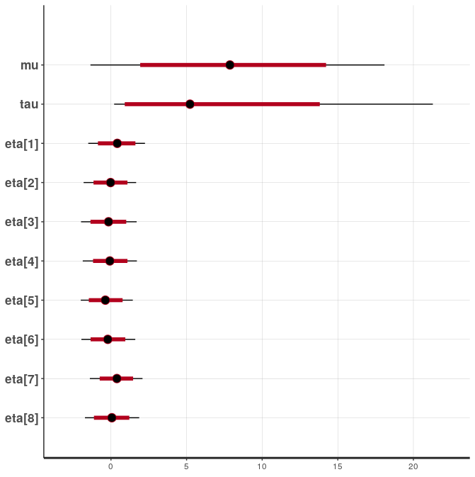

# Rstan

Here is an example of using a Docker container to interact with rstan, or
more specifically pulling it down as Singularity on the Sherlock cluster. You might want to do this
if you want to use an installation of rstan that is reproducible, meaning
your colleagues (and your future self!) can pull the container and reproduce
exactly what you did.


## 1. Pull the container

Although we are starting with a [pre-build image](https://hub.docker.com/r/jrnold/rstan/),
you could very well write your own Dockerfile, set up an automated build,
and then pull your own container. The repository for the container we use
above is [here](https://github.com/jrnold/docker-stan) in
case you want to derive a new one from it. See we want a quick example,
let's pull this container to Singularity:

```bash
$  singularity pull rstan.sif docker://jrnold/rstan 
```

If you aren't familiar with Docker, you might want to read 
about [automated builds](https://docs.docker.com/docker-hub/builds/).

## 2. Test your Container

Let's do a quick test. We can shell inside:

```bash
$ singularity shell rstan.sif
```

And then follow [getting started](https://github.com/stan-dev/rstan/wiki/RStan-Getting-Started) 
instructions to test the install:

```
Singularity> R

R version 4.0.0 (2020-04-24) -- "Arbor Day"
Copyright (C) 2020 The R Foundation for Statistical Computing
Platform: x86_64-pc-linux-gnu (64-bit)

R is free software and comes with ABSOLUTELY NO WARRANTY.
You are welcome to redistribute it under certain conditions.
Type 'license()' or 'licence()' for distribution details.

R is a collaborative project with many contributors.
Type 'contributors()' for more information and
'citation()' on how to cite R or R packages in publications.

Type 'demo()' for some demos, 'help()' for on-line help, or
'help.start()' for an HTML browser interface to help.
Type 'q()' to quit R.

> pkgbuild::has_build_tools(debug = TRUE)
Trying to compile a simple C file
Running /usr/local/lib/R/bin/R CMD SHLIB foo.c
gcc -I"/usr/local/lib/R/include" -DNDEBUG   -I/usr/local/include   -fpic  -g -O2 -fstack-protector-strong -Wformat -Werror=format-security -Wdate-time -D_FORTIFY_SOURCE=2 -g  -c foo.c -o foo.o
gcc -shared -L/usr/local/lib/R/lib -L/usr/local/lib -o foo.so foo.o -L/usr/local/lib/R/lib -lR
 
[1] TRUE
> 
```
And then test loading and doing some computations!

```bash
library("rstan")
Loading required package: StanHeaders
Loading required package: ggplot2
rstan (Version 2.19.3, GitRev: 2e1f913d3ca3)
For execution on a local, multicore CPU with excess RAM we recommend calling
options(mc.cores = parallel::detectCores()).
To avoid recompilation of unchanged Stan programs, we recommend calling
rstan_options(auto_write = TRUE)
```

Follow this instruction!

```R
rstan_options(auto_write = TRUE)
```

Then follow [this example](https://github.com/stan-dev/rstan/wiki/RStan-Getting-Started#example-1-eight-schools).
Note that the file [schools.stan](schools.stan) is in the present working directory,
and will be present in the container.

```R
schools_dat = list(J = 8, 
                    y = c(28,  8, -3,  7, -1,  1, 18, 12),
                    sigma = c(15, 10, 16, 11,  9, 11, 10, 18))
fit = stan(file = 'schools.stan', data = schools_dat)
print(fit)
Inference for Stan model: schools.
4 chains, each with iter=2000; warmup=1000; thin=1; 
post-warmup draws per chain=1000, total post-warmup draws=4000.

           mean se_mean   sd   2.5%    25%    50%    75%  97.5% n_eff Rhat
mu         8.04    0.12 5.05  -1.36   4.73   7.86  11.30  18.09  1894    1
tau        6.53    0.17 5.66   0.21   2.40   5.23   8.96  21.27  1172    1
eta[1]     0.40    0.02 0.96  -1.50  -0.23   0.42   1.04   2.25  3476    1
eta[2]    -0.02    0.02 0.87  -1.81  -0.58  -0.03   0.55   1.66  3354    1
eta[3]    -0.17    0.02 0.93  -1.98  -0.77  -0.16   0.43   1.70  3136    1
eta[4]    -0.06    0.01 0.90  -1.87  -0.64  -0.07   0.53   1.71  3864    1
eta[5]    -0.35    0.02 0.87  -2.00  -0.93  -0.37   0.19   1.44  3174    1
eta[6]    -0.21    0.02 0.90  -1.95  -0.81  -0.21   0.38   1.61  3215    1
eta[7]     0.37    0.01 0.87  -1.40  -0.19   0.39   0.95   2.09  3672    1
eta[8]     0.04    0.02 0.91  -1.72  -0.57   0.06   0.66   1.87  3409    1
theta[1]  11.45    0.17 8.45  -2.62   6.08  10.51  15.29  32.45  2371    1
theta[2]   7.96    0.09 6.27  -4.46   4.00   7.80  11.91  20.78  4905    1
theta[3]   6.29    0.13 7.79 -11.26   2.14   6.80  11.11  20.46  3536    1
theta[4]   7.61    0.10 6.48  -5.60   3.57   7.60  11.60  20.63  3893    1
theta[5]   5.15    0.10 6.29  -8.73   1.49   5.49   9.32  16.49  3629    1
theta[6]   6.26    0.10 6.65  -7.96   2.27   6.66  10.51  18.59  4149    1
theta[7]  10.84    0.12 6.73  -0.99   6.31  10.11  14.81  26.19  3052    1
theta[8]   8.40    0.14 7.72  -6.67   3.98   8.15  12.53  25.12  3252    1
lp__     -39.57    0.08 2.70 -45.45 -41.26 -39.30 -37.66 -34.97  1215    1

Samples were drawn using NUTS(diag_e) at Fri Jun 19 13:23:01 2020.
For each parameter, n_eff is a crude measure of effective sample size,
and Rhat is the potential scale reduction factor on split chains (at 
convergence, Rhat=1).
```

And the plot:
```R
plot(fit)
```



That should be good to get you started!


